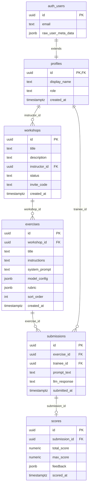

# Database Schema — AI Prompting Education Platform

## Overview

The platform uses Supabase (PostgreSQL) with Row-Level Security (RLS). The schema is built around two user roles: **instructors** (create and manage workshops) and **trainees** (participate and submit prompts).

## Entity-Relationship Diagram



## Tables

### `profiles`

Extends `auth.users`. One row per authenticated user.

| Column | Type | Notes |
|--------|------|-------|
| `id` | `uuid` | PK, FK → `auth.users.id` |
| `display_name` | `text` | User's display name |
| `role` | `text` | `instructor` or `trainee` |
| `created_at` | `timestamptz` | Auto-set on insert |

Auto-created via trigger `on_auth_user_created` when a new auth user signs up. Set `display_name` and `role` in `user_metadata` on sign-up.

### `workshops`

Created and managed by instructors.

| Column | Type | Notes |
|--------|------|-------|
| `id` | `uuid` | PK, auto-generated |
| `title` | `text` | Required |
| `description` | `text` | Optional |
| `instructor_id` | `uuid` | FK → `profiles.id` |
| `status` | `text` | `draft` / `published` / `archived` |
| `invite_code` | `text` | Unique; trainees use to join |
| `created_at` | `timestamptz` | Auto-set on insert |

### `exercises`

Prompting challenges within a workshop.

| Column | Type | Notes |
|--------|------|-------|
| `id` | `uuid` | PK, auto-generated |
| `workshop_id` | `uuid` | FK → `workshops.id` |
| `title` | `text` | Required |
| `instructions` | `text` | Task description shown to trainee |
| `system_prompt` | `text` | Optional system prompt for the LLM |
| `model_config` | `jsonb` | `{ provider, model, temperature, max_tokens }` |
| `rubric` | `jsonb` | `[ { criterion, max_points, description } ]` |
| `sort_order` | `integer` | Display order within workshop |
| `created_at` | `timestamptz` | Auto-set on insert |

**`model_config` example:**
```json
{
  "provider": "anthropic",
  "model": "claude-3-5-sonnet-20241022",
  "temperature": 0.7,
  "max_tokens": 1024
}
```

**`rubric` example:**
```json
[
  { "criterion": "Clarity", "max_points": 10, "description": "Is the prompt clear and unambiguous?" },
  { "criterion": "Specificity", "max_points": 10, "description": "Does the prompt include sufficient detail?" }
]
```

### `submissions`

A trainee's prompt attempt for a specific exercise.

| Column | Type | Notes |
|--------|------|-------|
| `id` | `uuid` | PK, auto-generated |
| `exercise_id` | `uuid` | FK → `exercises.id` |
| `trainee_id` | `uuid` | FK → `profiles.id` |
| `prompt_text` | `text` | The prompt written by the trainee |
| `llm_response` | `text` | LLM output (stored after evaluation) |
| `submitted_at` | `timestamptz` | Auto-set on insert |

### `scores`

Scoring result for a submission (instructor or automated).

| Column | Type | Notes |
|--------|------|-------|
| `id` | `uuid` | PK, auto-generated |
| `submission_id` | `uuid` | FK → `submissions.id` |
| `total_score` | `numeric` | Achieved score ≥ 0 |
| `max_score` | `numeric` | Maximum possible score > 0 |
| `feedback` | `jsonb` | Per-criterion breakdown + overall comment |
| `scored_at` | `timestamptz` | Auto-set on insert |

**`feedback` example:**
```json
{
  "criteria": [
    { "criterion": "Clarity", "score": 8, "comment": "Well-structured but could be more concise." },
    { "criterion": "Specificity", "score": 9, "comment": "Good level of detail provided." }
  ],
  "overall": "Strong submission demonstrating good prompting technique."
}
```

## Row-Level Security Summary

| Table | Who | Operations |
|-------|-----|-----------|
| `profiles` | Owner (self) | SELECT, UPDATE |
| `workshops` | Instructor (own) | SELECT, INSERT, UPDATE, DELETE |
| `workshops` | Trainee | SELECT (published only) |
| `exercises` | Instructor (own workshops) | SELECT, INSERT, UPDATE, DELETE |
| `exercises` | Trainee | SELECT (from published workshops) |
| `submissions` | Trainee (own) | SELECT, INSERT |
| `submissions` | Instructor (own workshops) | SELECT |
| `scores` | Trainee (own submissions) | SELECT |
| `scores` | Instructor (own workshops) | SELECT, INSERT |

## Migration Files

| File | Description |
|------|-------------|
| `supabase/migrations/20260315000001_create_core_schema.sql` | Create all tables, indexes, and the `on_auth_user_created` trigger |
| `supabase/migrations/20260315000002_create_rls_policies.sql` | Enable RLS and define all row-level security policies |

## Applying Migrations

With Supabase CLI:
```bash
supabase db push
```

Or manually via the Supabase SQL editor: run each migration file in order.
